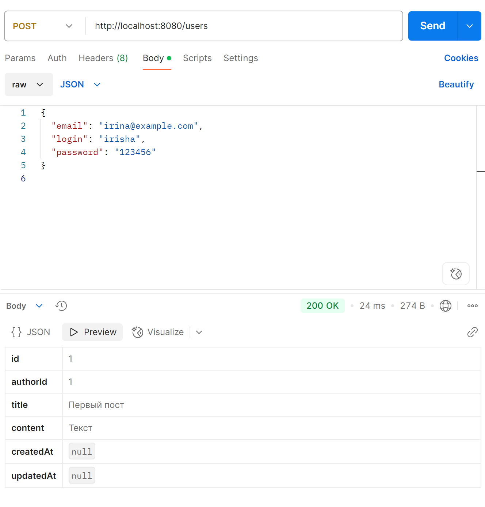
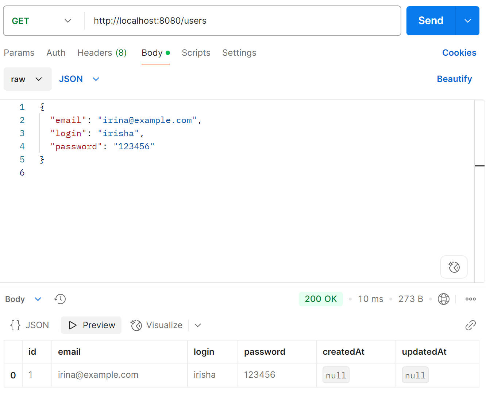
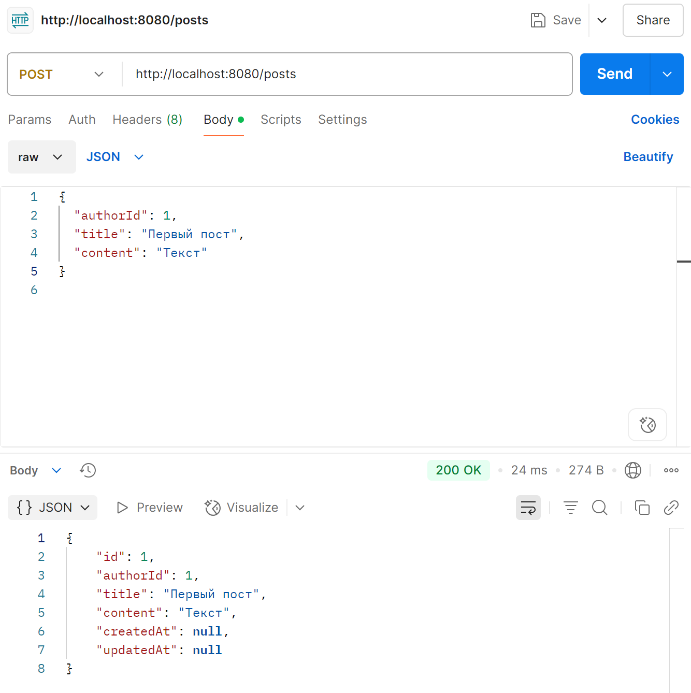
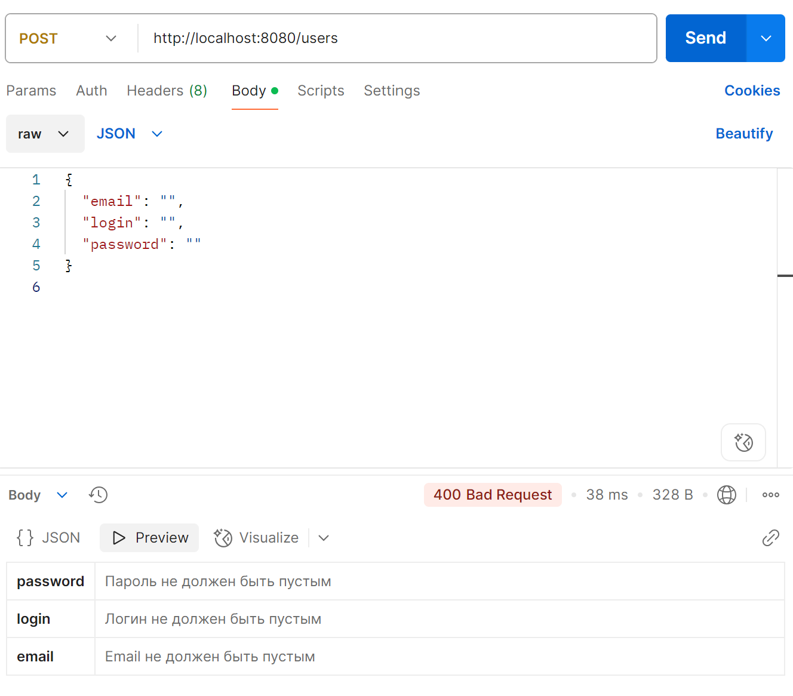

# Домашняя работа по Spring Boot

**Автор:** Смородина Ирина

## Описание

REST API для блога реализован на Spring Boot.  
Основные сущности: пользователь (User) и пост (Post).

Присутствуют:
- Поддержка CRUD-операций: создание, получение, обновление, удаление.
- Генерация уникальных id.
- Валидация входных данных через аннотации в моделях.
- Обработка ошибок валидации — ответы с подсказками. 

Тестировка проводилась с помощью Postman.

## Примеры API

- POST /users — создание пользователя
- GET /users — список пользователей
- POST /posts — создание поста
- GET /posts — список постов

## Как запустить

1. Открыть проект в IntelliJ IDEA.
2. Запустить класс `BankSpringApplication`.
3. Тестировать через Postman на адресе http://localhost:8080

## Тестирование

Проверка POST на порт http://localhost:8080/users]

Проверка GET на порте http://localhost:8080/users

Проверка POST на порт http://localhost:8080/posts

Проверка POST при отправке с некорректными данными на порт http://localhost:8080/users

